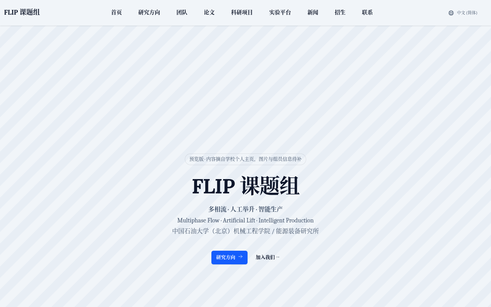

# FLIP 课题组网站（预览版）

FLIP = **F**low (multiphase) · **L**ift (artificial) · **I**ntelligent **P**roduction
多相流 · 人工举升 · 智慧开采 — 中国石油大学（北京）机械工程学院 / 能源装备研究所



> ⚠️ 预览版。文字内容仅摘自学校个人主页 <https://faculty.cup.edu.cn/zhujianjun/index.html>；
> 所有照片、组员名单、新闻、实验平台、英文稿均为**明显的“待补”占位块**，上线前需负责人补充并审定。

## 技术栈

- [Hugo](https://gohugo.io/) extended **0.162.0**（版本钉在 `hugoblox.yaml`）
- [HugoBlox Kit](https://github.com/HugoBlox/kit) `modules/blox v0.12.0`（基于 Academic CV 模板改成课题组结构），Tailwind CSS v4
- Node.js ≥ 22、pnpm 10（Tailwind CLI 需要）

## 目录结构

```
config/_default/      站点配置：hugo.yaml、languages.yaml（zh 默认、en 预留）、menus.zh.yaml / menus.en.yaml、params.yaml
content/zh/           中文内容（默认语言，站点根路径 /）
  _index.md           首页：横幅 + 研究方向卡片 + 负责人 + 新闻
  research/ team/ publications/ projects/ facilities/ news/ join/ contact/
content/en/           英文版结构占位（/en/ 下），待补英文稿
data/authors/         人员资料（zhujianjun.yaml；组员可按同样格式添加）
layouts/_shortcodes/  placeholder.html（待补占位块）、u.html（站内链接自动带子路径）
layouts/_partials/functions/build_links.html  修补 blox v0.12.0 在 Hugo 0.162 下的空 map 报错
assets/css/custom.css 占位块样式与少量版式调整
static/uploads/       横幅占位图（换成真实照片即可）
```

## 本地预览

```bash
pnpm install
hugo server            # http://localhost:1313
hugo --minify          # 输出到 public/
```

## 写作约定

- 待补内容用占位块：`说明`
- 站内链接用 `[文字]()`，部署到 `https://<user>.github.io/flip-site/` 子路径时不会断链。
- 新闻：在 `content/zh/news/` 下每条新闻建一个 Markdown 文件（日期写在 front matter）。
- 英文版：在 `content/en/` 下对应页面补英文稿即可，菜单已在 `menus.en.yaml` 配好。

## 部署到 GitHub Pages（需负责人批准后再做）

1. 在 GitHub 新建仓库（例如 `zhujj09/flip-site`），推送本仓库到 `main` 分支。
2. 仓库 Settings → Pages → Source 选 **GitHub Actions**。
3. `.github/workflows/deploy.yml` 会在每次推送 `main` 时自动构建并发布；地址为 `https://zhujj09.github.io/flip-site/`。
4. 若使用自定义域名：在 `static/CNAME` 写入域名，并在 DNS 处添加 CNAME 记录指向 `zhujj09.github.io`，同时把 `config/_default/hugo.yaml` 的 `baseURL` 改为该域名。

## 参考站点（风格调研）

- Tulsa University Artificial Lift Projects (TUALP)：<https://tualp.utulsa.edu/>
- Stanford Smart Fields Consortium：<https://smartfields.stanford.edu/>
- MIT Hatsopoulos Microfluids Laboratory：<https://hml.mit.edu/>
- 清华大学反应工程实验室（FLOTU）：<http://www.flotu.tsinghua.edu.cn/>
- 浙江大学化学工程与烯烃聚合课题组：<http://www.cregroup.zju.edu.cn/>

## 致谢

站点模板基于 [HugoBlox Kit](https://github.com/HugoBlox/kit)（MIT 许可）。为便于国内访问，已改用系统字体、去掉页脚推广链接和外部 CDN 资源。
